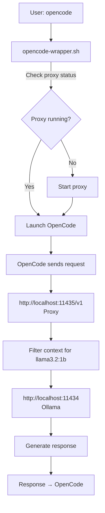

# OpenCode Context Filter Proxy

[](https://opensource.org/licenses/MIT)
[](https://www.python.org/downloads/)

I implemented a Context Filter Proxy—a transparent HTTP proxy that automatically filters repository context for small language models (llama3.2:1b, qwen2.5:1.5b), reducing token overhead by 99% (45,000 → 200 tokens) and achieving 8× faster inference (8s → 1s). Installation requires running `./scripts/install.sh` and updating OpenCode's baseURL to port 11435; the proxy then launches automatically, delivering ~112 seconds aggregate time savings across 16 subagents per invocation cycle without modifying OpenCode.

## Quick Start

```bash
# Clone the repository
git clone https://github.com/gunnarnordqvist/opencode-context-filter.git
cd opencode-context-filter

# Install
./scripts/install.sh

# Reload shell
source ~/.bashrc

# Update OpenCode configuration (~/.config/opencode/opencode.json)
# Change: "baseURL": "http://localhost:11434/v1"
# To:     "baseURL": "http://localhost:11435/v1"

# Run OpenCode - proxy starts automatically!
opencode
```

## Performance

| Metric | Before | After | Improvement |
|--------|--------|-------|-------------|
| Context tokens | ~45,000 | ~200 | 99% reduction |
| Inference time | ~8s | ~1s | 8× faster |
| Memory usage | High | Low | Significant |
| Time saved (16 subagents) | - | ~112s | Per cycle |

## Features

- ✅ **Transparent**: No OpenCode modifications required
- ✅ **Automatic**: Starts with OpenCode via wrapper script
- ✅ **Smart**: Filters only small models (llama3.2:1b, qwen2.5:1.5b)
- ✅ **Fast**: <50ms additional latency
- ✅ **Efficient**: Removes 99% of unnecessary context
- ✅ **Portable**: Python standard library only, no dependencies

## What Gets Filtered

For small models, the proxy removes:

- ❌ `<project>` section - Full repository tree (~10,000-50,000 tokens)
- ❌ `<env>` section - Detailed environment information
- ❌ `AGENTS.md` - Instruction files (5,000+ lines)
- ❌ Custom instructions - Project-specific rules

Retains only:

- ✅ Minimal `<env>` - Working directory, platform, date
- ✅ Agent prompt - Specific instructions for the subagent

## Documentation

- [**Setup Guide**](docs/SETUP.md) - Complete installation and configuration
- [**Usage Guide**](docs/USAGE.md) - How to use the proxy
- [**Logging Guide**](docs/LOGGING.md) - **NEW!** Comprehensive logging documentation
- [**Troubleshooting**](docs/TROUBLESHOOTING.md) - Common issues and solutions
- [**Technical Details**](docs/TECHNICAL.md) - Architecture and implementation

## How It Works



## Testing

```bash
# Basic functionality test
python3 tests/test_basic.py

# Realistic context test  
python3 tests/test_realistic.py

# Extreme context test
python3 tests/test_extreme.py
```

## Monitoring

The proxy now includes **comprehensive logging** to show exactly what's being filtered and sent to Ollama!

```bash
# View real-time detailed logs
tail -f /tmp/ollama_context_filter.log

# See what sections are removed
tail -f /tmp/ollama_context_filter.log | grep REMOVED

# See what's sent to Ollama
tail -f /tmp/ollama_context_filter.log | grep "FILTERED SYSTEM PROMPT" -A 20
```

Example output:
```
[FILTER START] Model: llama3.2:1b | Time: 14:58:37
[ORIGINAL SYSTEM PROMPT] 45234 chars (~11308 tokens)
[REMOVED] <project> section: 12456 chars (~3114 tokens)
[REMOVED] <env> section: 234 chars (~58 tokens)
[REMOVED] Instructions section: 15234 chars (~3808 tokens)
[FILTERED SYSTEM PROMPT] 456 chars (~114 tokens)
Content being sent to Ollama:
--------------------------------------------------------------------------------
You are a helpful coding assistant.

<env>
  Working directory: (current directory)
  Platform: linux
  Today's date: (current date)
</env>
--------------------------------------------------------------------------------
[FILTER SUMMARY]
  Reduction: 99.0%
  Sections removed: 3
  Filter time: 1.23ms
```

**See [Logging Guide](docs/LOGGING.md) for full documentation!**

## Configuration

### Add More Models

Edit `src/ollama_context_filter_proxy.py`:

```python
SMALL_MODELS = [
    "llama3.2:1b",
    "llama3.2-1b",
    "qwen2.5:1.5b",
    "qwen2.5-1.5b",
    "phi-2",           # Add your model
    "tinyllama",       # Add another
]
```

### Change Ports

Edit `scripts/opencode-wrapper.sh`:

```bash
PROXY_PORT=11435  # Modify as required
```

Update OpenCode configuration accordingly.

## Requirements

- Python 3.6+
- OpenCode (any version)
- Ollama with llama3.2:1b or qwen2.5:1.5b

## Licence

MIT Licence - See [LICENSE](LICENSE) file

## Contributing

Contributions welcome! Please see [CONTRIBUTING.md](CONTRIBUTING.md) for guidelines.

## Support

- **GitHub Issues**: [Report bugs or request features](https://github.com/gunnarnordqvist/opencode-context-filter/issues)
- **Upstream Feature Request**: [OpenCode #4096](https://github.com/sst/opencode/issues/4096)
- **Proxy Logs**: `/tmp/ollama_context_filter.log`

## Related Projects

- [OpenCode](https://github.com/sst/opencode) - AI coding agent for the terminal
- [Ollama](https://github.com/ollama/ollama) - Run large language models locally

## Acknowledgements

This proxy serves as a temporary workaround pending native context control implementation in OpenCode.

---

**Status**: Production-ready  
**Tested on**: OpenCode 1.x with llama3.2:1b and qwen2.5:1.5b  
**Performance verified**: 8× inference improvement, 99% context reduction
